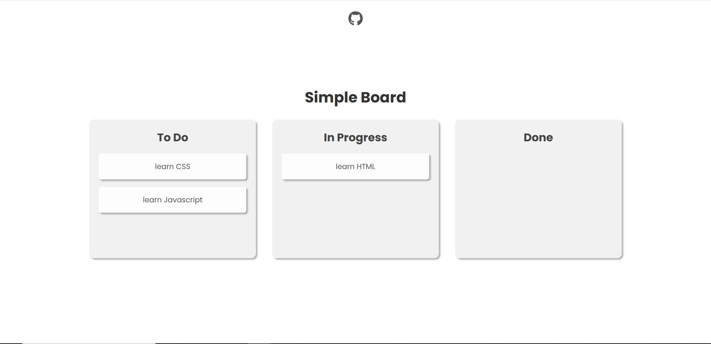

# Simple Drag and Drop Board

Proyek ini adalah implementasi dasar dari fitur **drag and drop** menggunakan HTML, CSS, dan JavaScript tanpa library tambahan. Cocok untuk belajar konsep dasar interaksi drag & drop pada elemen DOM.

## 📦 Fitur

- Memindahkan kartu antar kolom (To Do, In Progress, Done)
- Highlight kolom saat elemen sedang di-drag di atasnya
- Interaksi responsif dan ringan
- Tanpa library eksternal

## 🚀 Cara Menjalankan

Buka link berikut: https://drag-and-drop-sage.vercel.app/

## 🛠️ Teknologi

- HTML5
- CSS3
- Vanilla JavaScript (DOM Events: dragstart, dragover, drop, dll)

## 🎯 Tujuan Pembelajaran

Proyek ini dibuat untuk:

- Memahami event drag & drop di JavaScript
- Mempelajari manipulasi DOM secara langsung
- Latihan logika pemindahan elemen antar parent

## 📸 Cuplikan

